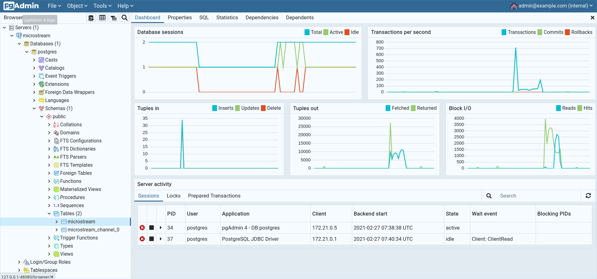

# Getting started

## How to start the application

Use the following command to run **microquark** in development mode:

```shell script
mvn quarkus:dev
```

If you want to build and run a native image see [here](NATIVE.md).

The application has fully started when you see an entry: `Listening on: http://localhost:8080`

## Getting data in

You have two possibilities to load data: automatically with the
[DataImporter](/src/test/kotlin/importer/DataImporter.kt) or manually via REST.

### Using the DataImporter

microquark comes with a [DataImporter](/src/test/kotlin/importer/DataImporter.kt) that allows you to load referendums from a CSV file
(see `data.csv` in the root folder). It is a small Kotlin program that you can start in your IDE
(e.g. IntelliJ IDEA or Eclipse). It creates all the referendums defined in the CSV file
and performs a (random) election on every submission.

In total, this generates around 2.5 GB of data on your disk (depending on how many people show
up to vote!). 

### Adding data via REST

microquark comes with several REST endpoints to interact with. You can e.g. add referendums, list all
referendums, perform an election on a referendum and get the voting results.

For details, see the [REST Guide](REST.md).

## Deleting the data

### Storage target filesystem

If you want to start with an empty storage again, just run the following command:

```shell script
mvn clean
```

This deletes all the content from the folder `target/`. The data will be written to the subfolder
`target/data/` or to `target/target/data/`. This depends on how you run the application
(JVM dev mode, JVM JAR mode or native mode).

### Storage target PostgreSQL

For PostgreSQL, you can use **pgAdmin** which is included in `docker-compose.yml`.
If you start all the databases with the following command, **pgAdmin** is also started automatically:

```shell script
docker-compose up
```

**pgAdmin** is running on the following URL: http://127.0.0.1:48080/

The login credentials are:
* Username: `admin@example.com`
* Password: `root`

Then click on `Add New Server` and use the following settings:
* Name: `microstream`
* On tab **Connection**:
  * Host name/address: `postgres`
  * Port: `5432`
  * Username: `postgres`
  * Password: `postgres`

Then just delete both tables `microstream` and `microstream_channel_0` via right mouse-click
`Delete/Drop`.
    


