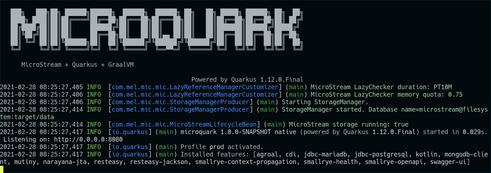

# MicroStream integration

### Overview

On the start of the application, some info's about MicroStream are logged. This includes the duration and memory quota
of the LazyChecker. Furthermore, the used storage target is shown.



### Lazy Checker

The **duration** and the **memory quota** of the Lazy Checker can be configured in the
[application.properties](../src/main/resources/application.properties) file.

### Storage targets

The default storage target is `filesystem`.

You can easily switch to **PostgreSQL**, **MariaDB**, **MongoDB** or even an **in-memory** storage. See the comments in
[application.properties](../src/main/resources/application.properties) for guidance.

For your convenience, all dependencies and extensions for the different storage targets are included. You see that in
the screenshot above: _Installed features_ in the last line contains `agroal`, `jdbc-mariadb`,
`jdbc-postgresql` and `mongodb-client`. This is also true if you perform a [native build](NATIVE.md). Hence, the
generated executable is bigger than it has to be. For productive use, you would of course strip all the dependencies and
extensions that you do not need.

The in-memory storage is especially useful if you run automated tests. For
[QuarkusTest's](https://quarkus.io/guides/getting-started-testing) this is the default setting.

A [docker-compose](../docker-compose.yml) file is included in the root directory. You can start all the databases with the
following command:

```shell script
docker-compose up
```

#### MariaDB

For MariaDB, the default settings of the database did not work. It could not deal with the big packets (blobs) that were
written by MicroStream. After increasing the `max_allowed_packet` size to a much higher value, the issue was solved (
see [docker-compose.yml](../docker-compose.yml)).

@MicroStream: this could be a useful hint in the
[MicroStream docs for MariaDB](https://manual.docs.microstream.one/data-store/storage-targets/sql-databases/mariadb).

### Data model

The votes are simply modeled as lists of booleans. As MicroStream is very fast, it was not required to optimize this any
further. If you query the outcome of a referendum, then actually all the numbers (sum, percentage etc.)
are calculated from scratch again. You probably won't do that in a real project, but it is a nice demonstration that you
can do that with MicroStream and get the results back fast enough.