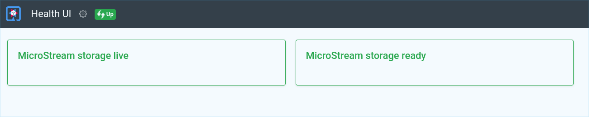

# Quarkus integration

The goal was to integrate MicroStream so that it almost feels like a _normal_ Quarkus extension.

### Live-Reload & Hot-Deployment

Full support for Live-Reload and Hot-Deployment. Clean shutdown and re-opening of the
MicroStream storage.

### MicroStream Lazy Checker

`Duration` and `memory quota` of the Lazy Checker can be configured via `application.properties`.
  
### MicroStream storage targets

Easily configurable via `application.properties`.

* in-memory
* filesystem
* JDBC (PostgreSQL, MariaDB)
* MongoDB

### MicroStream health status

* [readiness](http://127.0.0.1:8080/q/health/ready)
* [liveness](http://127.0.0.1:8080/q/health/live)

### Testing

For testing, you can use the supported in-memory filesystem. Every `QuarkusTest` will use
the in-memory filesystem by default. This is configured in the file
`application.properties` in the test resources.

The in-memory filesystem is provided by [JimFS](https://github.com/google/jimfs/).