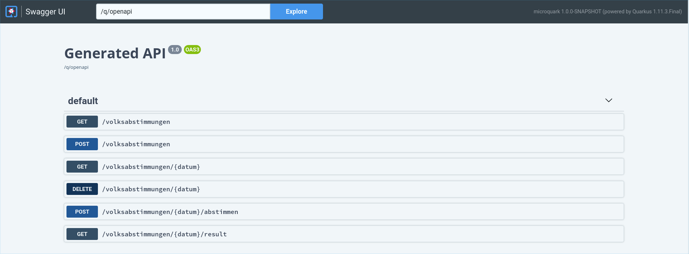

## REST API

There are several ways to use the REST API.

* You can use [Swagger](https://swagger.io/) which runs here: http://127.0.0.1:8080/q/swagger-ui/
  

* If you prefer to use [cURL](https://curl.se/) have a look at the commands below

* The [DataImporter](/src/test/kotlin/importer/DataImporter.kt) (included standalone Kotlin program)
  is helpful to automatically import several Volksabstimmungen and execute the elections. This gives you a good starting
  ground!

### cURL commands

#### Show all Volksabstimmungen

```shell script
curl "http://127.0.0.1:8080/volksabstimmungen"
```

This lists all the Volksabstimmungen with date, and the topics to vote on.

#### Create a new Volksabstimmung

```shell script
curl "http://127.0.0.1:8080/volksabstimmungen" -H "Content-Type: application/json" -d '{"datum":"2021-02-28","vorlagen":["Should MicroStream be used for government projects?"]}'
```

This inserts a new Volksabstimmung. You can define the date when the election takes place. Furthermore, a list of topics
that the population can vote on (Vorlagen).

#### Show a single Volksabstimmung

```shell script
curl "http://127.0.0.1:8080/volksabstimmungen/2021-02-28"
```

#### Delete a Volksabstimmung

```shell script
curl -X DELETE "http://127.0.0.1:8080/volksabstimmungen/2021-02-28"
```

Removes a Volksabstimmung including all the results if available.

#### Execute an election for a Volksabstimmung

```shell script
curl -X POST "http://127.0.0.1:8080/volksabstimmungen/2021-02-28/abstimmen" -H "Content-type: application/json"
```

The voter turnout and the votes will be calculated randomly. Note that an election can only be executed once per
Volksabstimmung.

#### Get results for a Volksabstimmung

```shell script
curl "http://127.0.0.1:8080/volksabstimmungen/2021-02-28/result"
```

Returns the detailed results of the referendum. Note that all the results are calculated on-the-fly directly from the
MicroStream storage data root!

### cURL tips

* For verbose output add the parameter `-v`, e.g. `curl -v "http://127.0.0.1:8080/volksabstimmungen"`

* To time the requests, add `time` at the beginning. E.g. `time curl "http://127.0.0.1:8080/volksabstimmungen"`

* If you want to pretty-print a JSON result, pipe it through `json_pp`,
  e.g. `curl "http://127.0.0.1:8080/volksabstimmungen/2021-02-28/result" | json_pp`